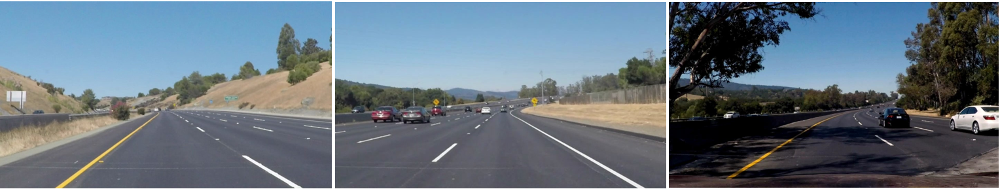
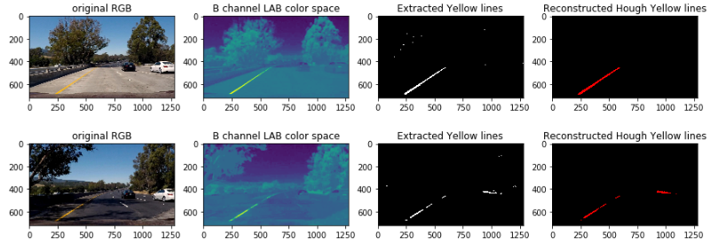
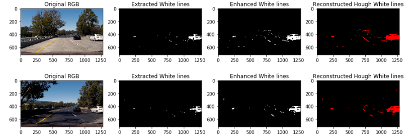
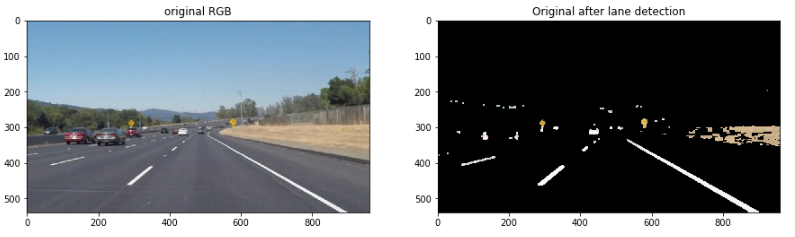
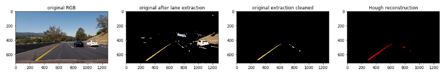
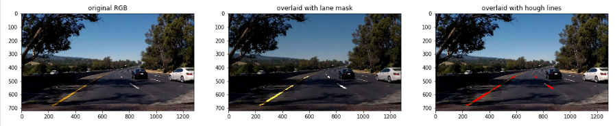
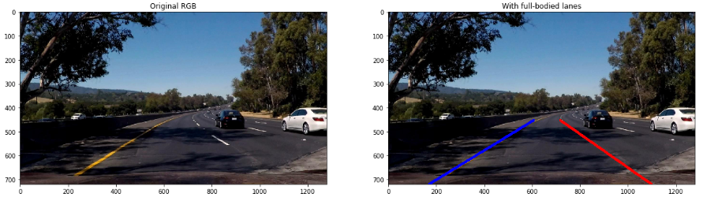

# Finding-Lane-Lines-on-the-Road
Create a Lane Finding pipeline that finds lane lines on the road

## Description

When we drive, we use our eyes to decide where to go. The lines on the road act as our constant reference for where to steer the vehicle. Naturally, one of the first things we would like to do in developing a self-driving car is to automatically detect lane lines using an algorithm.

In this project a line detection algorithm is proposed to detect lane lines in images using Python and OpenCV. OpenCV means "Open-Source Computer Vision", which is a package that has many useful tools for analyzing images. Recognizing lane markings on roads is possible using well known computer vision techniques.

This project is part of UDACITY's Self-Driving Car Engineer Nanodegree.

## Issue Statement

The objective is to be able to detect lane lines in images and videos real-time. Images present various difficult levels with varying levels of shade, solid and dotted lines, of different colors and various x-y dimensions. A sample of the training set is shown below.

## Detection Pipeline Workflow 

I started by exploring the training images and looking at various color spaces to indetify the best detection strategy. The images come with yellow and white lane lines. I opted for:
- Using LAB color space, and more particularly the B channel, as the yellow lines stand neatly out. This strategy proved to perform superbly on images with shades while other color spaces could not perform similarly.
- Using HLS color space for white lines.

Pipeline:
- Extract yellow lines using LAB B channel
White is not extracted at all but the yellow extraction proves robust despite some deterioration.

- Extract white lines using HLS color space.
Here, only white is extracted. I re-inforce features using `cv2.dilate()` and `cv2.erode()` steps. Note that a lot of noise is also captured (white car on the right) which will need to be handled next.

In both approaches, I used a filtring approach with `cv2.inRange()`. I validated the approach, even with challenging images, testing line extracting using `cv2.HoughLinesP`

- Combine both extractions so that to be able to overlay onto the original images at a later stage.
Note that I performed several steps using `cv2.dilate()` and `cv2.erode()` in order to enhance the extracted line patterns at this stage. The use of a Canny filter did not prove useful on top.

In the sample below, we can see a couple of yellow road signs extracted during the process ! Line re-inforcement is also visible. 

At this stage we now must:
- Eliminate captured noise using Region Of Interest approach. The output is a clean mask capturing both white and yellow lines even in shady environment.
In the example below, we can see the noise which gets eliminated (no more white car!) and we are left with a neat mask capturing both lanes.

Now we can finalize:
- Apply Hough Line detection on the mask and collect identified line segments for the next additonal step.
In the example below, I validate the good performance on both line types despite shadow conditions. Next we will make up for full solid lines.

- Calculate line formulas in order to draw and overlay full, solid, lines onto the original images. I used a mask to perform this combination step.

The output is shown in the next section below.

The line extraction pipeline proved very efficient using movies even with challenging shading conditions.

## Results

Final result with good detection performance.

